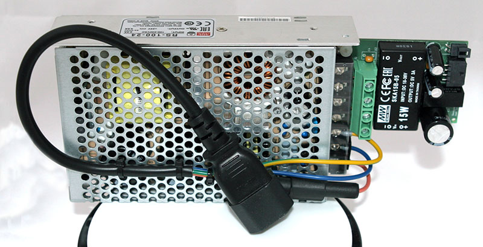
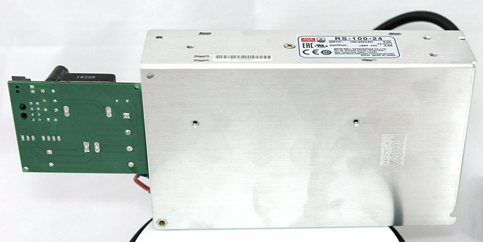
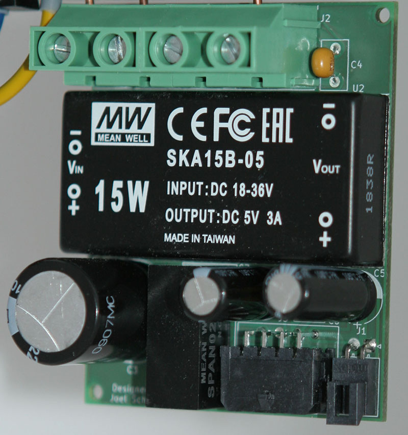
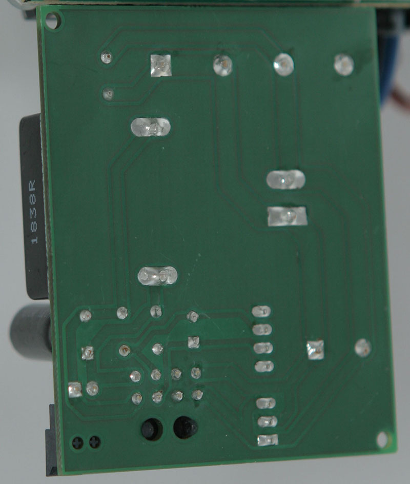

# 8-inch floppy drive - Power supply

> The 8" floppy drive power suplly can be used to power 8-inch floppy disk drives (using a suitable cable).

## Table of Contents
- [Introduction](#Introduction)
- [Specifications](#Specifications)
- [Setup](#Setup)
- [Compatibility](#Compatibility)
- [Cables](#Cables)
- [Manufacturing](#Manufacturing)
- [FAQ](#FAQ)
- [Licensing](#Licensing)

## Introduction
Many 8-inch floppy drives use different sockets and pinouts for power delivery. They also required power lines with up to 24V DC, some may need -5V DC lines and others even need a direct 120V/230V AC connection. This is a problem, since modern ATX power supplies only supply lines up to 12V.
To solve this problem a seperate power supply is necessary that provides all necessary power lines. Different connection cables can be used to power drives with different connectors.
This project aims to provide the schematic, PCB design and firmware source code to build such a supply.
The assembly consists of two part, a regular AC-DC 24V 100W power supply and an DC-DC conversion board that generates the auxillary voltages.

 

## Specifications

### Assembly Specifications
- Power
  - Input voltage: 120V/230V AC
  - Maximum input current: 1.0A@120V / 0.5A@230V
  - Input Connector: 3-pin screw terminal
  - Fusing: T 2.5A@120V / T 1.6A@230V

### Board Specifications
- Power
  - Input voltage: 24V DC
  - Maximum input current: 4.2A
  - Input Connector: 4-pin screw terminal
- Maximum number of drives per adapter: 2
- Pass-through voltages:
  - 24V DC 83W
- Output voltages:
  - +5V DC 15W
  - -5V DC 2W

## Setup
The power supply can drive up to two drives (using a Y/splitter cable) and an adapter board (via AUX power socket).

### Connections
Check to manual of the drive you'd like to power for the correct pinout of the power socket.

Some drives required a direct mains AC line connection. Make sure that your drive model is compatible with your mains AC voltage!

__**Important: Connecting the wrong mains AC voltage to your drive will destoy it!**__

You can search for the right AC and DC cable in the [list of drives](#Compatibility) and/or the [list of cables](#Cables) below.

### Fusing
The power input cable should have an inline fuse holder installed. The correct fuse has to be selected depending on the voltage of the mains AC line.

_**WARNING! RISK OF ELECTRIC SHOCK! Power cable must be unplugged prior to opening the fuse holder!**_

### Start-up
Begin with all power cables disconnected. Connect the drive and the power supply with the right DC cable. (If applicable) Connect the AC adaptor cable to the drive.
Now connect the power supply and (if applicable) the AC adaptor cable to mains using a power cable.

## Compatibility
The following list shows some 8-inch floppy drive models and the respective cables that should be correct for them.

| Model | DC cable | AC cable | Tested1 |
| ----- | -------- | -------- | ------ |
| Mitsubishi M2896-63 | [TE Connectivity 1-480270-0](#TE-Connectivity-1-480270-0) | - | ❓ |
| NEC FD1165 | [TE Connectivity 171822-7](#TE-Connectivity-171822-7) | - | ❓ |
| Shugart SA800 Shugart SA801 | [TE Connectivity 1-480270-0](#TE-Connectivity-1-480270-0) | [TE Connectivity 1-480304-0](#TE-Connectivity-1-480304-0) | ❓ |
| Shugart SA810 Shugart SA860 | [TE Connectivity 1-480763-0](#TE-Connectivity-1-480763-0) | - | ❓ |
| Shugart SA850 Shugart SA851 | [TE Connectivity 1-480270-0](#TE-Connectivity-1-480270-0) | [TE Connectivity 1-480700-0](#TE-Connectivity-1-480700-0) | ❓ |
| Tandon TM848-1E Tandon TM848-2E | [TE Connectivity 1-480270-0](#TE-Connectivity-1-480270-0) | - | ❓ |
| Y-E DATA YD-180 | [TE Connectivity 1-480270-0](#TE-Connectivity-1-480270-0) | - | ✅ |

1 ✅: Cable(s) have been successfully tested. ❓: Cable(s) should be correct according to the manual, but haven't been tested yet. 

## Cables
The cable drawings were designed using [Microsoft Visio](https://en.wikipedia.org/wiki/Microsoft_Visio). The Visio files are located in the [Cables](Cables) sub-folders.

### DC cables
#### TE Connectivity 1-480270-0
[PDF](Cables/Floppy%20DC/TE%20Connectivity%201-480270-0.pdf) 
[Sample image](Cables/Floppy%20DC/TE%20Connectivity%201-480270-0.jpg)

#### TE Connectivity 1-480763-0
[PDF](Cables/Floppy%20DC/TE%20Connectivity%201-480763-0.pdf) 
[Sample image](Cables/Floppy%20DC/TE%20Connectivity%201-480763-0.jpg)

#### TE Connectivity 171822-7
[PDF](Cables/Floppy%20DC/TE%20Connectivity%20171822-7.pdf) 
[Sample image](Cables/Floppy%20DC/TE%20Connectivity%20171822-7.jpg)

#### Y-cable/splitter cable
[PDF](Cables/Floppy%20DC/Y-cable,%20splitter%20cable.pdf) 
[Sample image](Cables/Floppy%20DC/Y-cable,%20splitter%20cable.jpg)

### AC cables
#### TE Connectivity 1-480304-0
[PDF](Cables/Floppy%20AC/TE%20Connectivity%201-480304-0.pdf) 
[Sample image](Cables/Floppy%20AC/TE%20Connectivity%201-480304-0.jpg)

#### TE Connectivity 1-480700-0
[PDF](Cables/Floppy%20AC/TE%20Connectivity%201-480700-0.pdf) 
[Sample image](Cables/Floppy%20AC/TE%20Connectivity%201-480700-0.jpg)

### AUX cable
#### TE Connectivity 171822-4
[PDF](Cables/Aux%20DC/TE%20Connectivity%20171822-4.pdf) 
[Sample image](Cables/Aux%20DC/TE%20Connectivity%20171822-4.jpg)

## Manufacturing
The schematics and PCB were designed using [KiCad](https://kicad-pcb.org/). The KiCad project is located in the [Schematics & PCB](Schematics%20&%20PCB) folder. 

### Schematic
[PDF](Schematics%20&%20PCB/8%20Inch%20Floppy%20Power%20Supply/8%20Inch%20Floppy%20Power%20Supply.pdf) 
[PNG](Schematics%20&%20PCB/8%20Inch%20Floppy%20Power%20Supply/8%20Inch%20Floppy%20Power%20Supply.png)

### PCB Gerber files
[ZIP](Schematics%20&%20PCB/8%20Inch%20Floppy%20Power%20Supply/pcb.zip)

### PCB manufacturing
The board has a size of 51.5mm x 63mm, a minimum trace distance of 0.2mm and the minimal drill diameter is 0.8mm.
There are two layers and a total of 43 holes to drill. All holes, except for the two mounting holes, are plated.

If you are within the EU, you may want to consider choosing AISLER as your PCB manufacturer.

[PCB on AISLER](https://aisler.net/p/IWASNETN)

### Bill of materials
| Reference | Component | Housing / Footprint | Type | Quantity |
| --------- | --------- | ---------------------- | ---- | -------- |
| C3 | Electrolytic Capacitor 2200 µF 35V | Radial D16.0mm P7.50mm | Yageo SY035M2200B7F-16322 | 1 |
| C5 | Electrolytic Capacitor 470µF 6.3V | Radial D8.0mm P3.50mm | Yageo SY006M0470B3F-08112 | 1 |
| C7 | Electrolytic Capacitor 220µF 6.3V | Radial D8.0mm P3.50mm | Yageo SY006M0220BZF-06112 | 1 |
| C4 | Ceramic Capacitor 1µF 50V | Disc D7.5mm W4.4mm P5.00mm | Kemet C330C105M5U5TA+2  | 1 |
| C6, C8 | Ceramic Capacitor 470nF 50V | Disc D5.1mm W3.2mm P5.00mm | Kemet C322C474M5U5TA+2  | 1 |
| J1 | AUX power out socket | 1 x 2 x 2.54mm | Molex 1053131202 | 1 |
| J2 | Power in screw terminal | 1 x 2 x 9.5mm | Degson DG950-9.5-02P-14-00AH | 2 |
| J3 | Main power out socket | 2 x 4 x 3.0mm | Molex 430450800 | 1 |
| U1 | 2W 5V isolated DC-DC Converter | TRACO TMR xx | Mean Well SPAN02B-052 | 1 |
| U2 | 15W 5V isolated DC-DC Converter | TRACO TEN10 xx | Mean Well SKA15B-052 | 1 |

2 Suggestion; Other types may be used.  

## FAQ
##### My drive is not listed in the compatibility list, will it work?
>**Check the manual of your drive to see what kind of connector and pinout is used.
Go through the available cables to see if one matches the requirments of your drive. If that is the case, the drive will very likely work.**

##### Can I build and use this for personal, non-commercial purposes?
>**Yes.**

##### Can I build and use this for work in a non-profit organization?
>**[Please contact me.](https://mailhide.io/e/egvcl)**

##### Can I build and use this for work in a commercial setting?
>**[Please contact me.](https://mailhide.io/e/egvcl)**

## Licensing
This project is licensed under the [CC BY-NC-ND 4.0 license](LICENSE).

